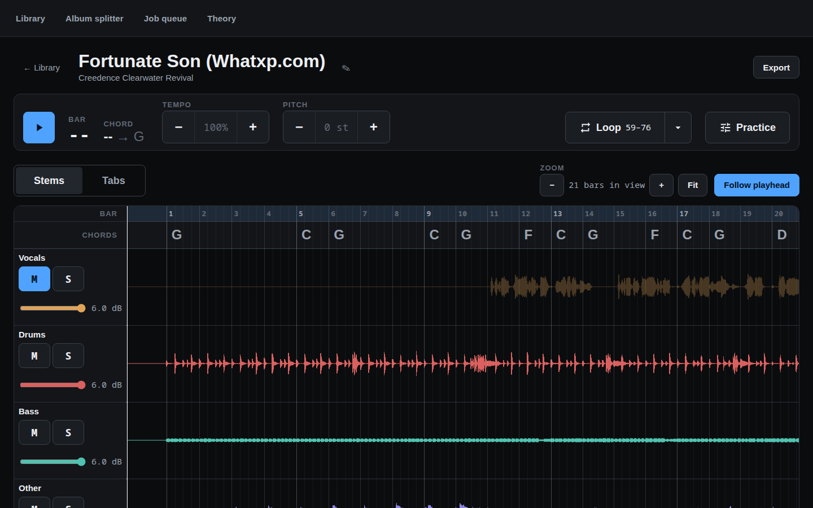
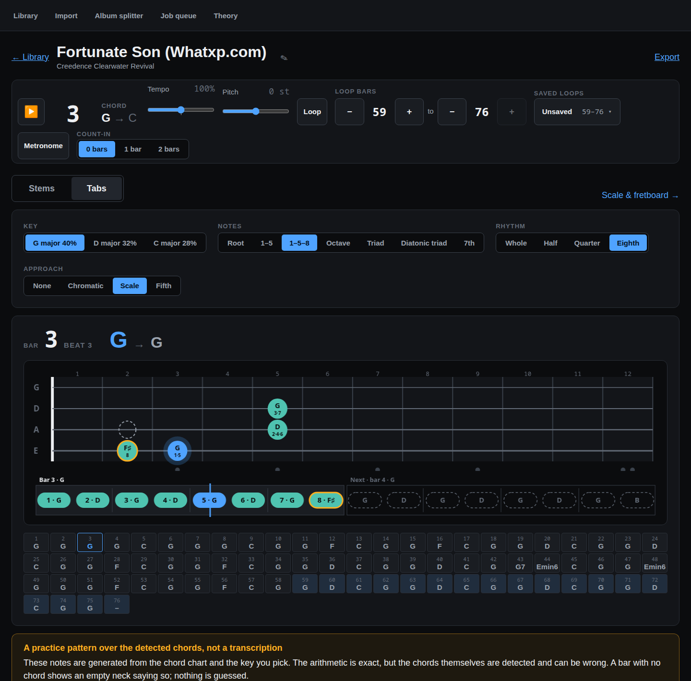
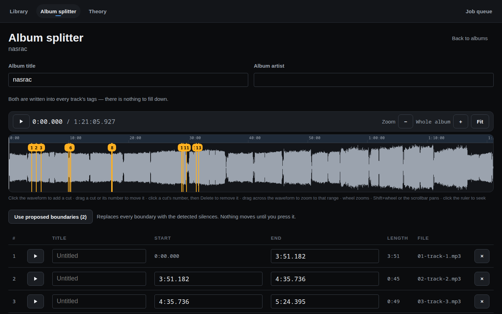
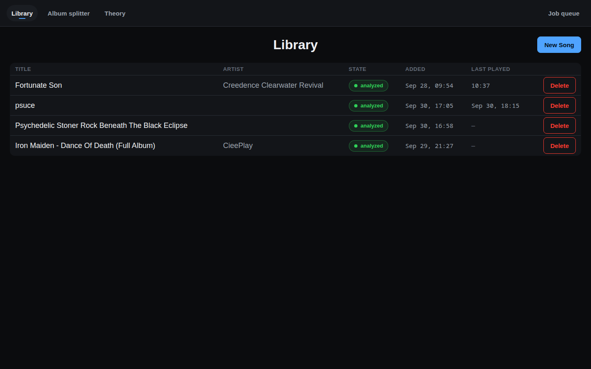
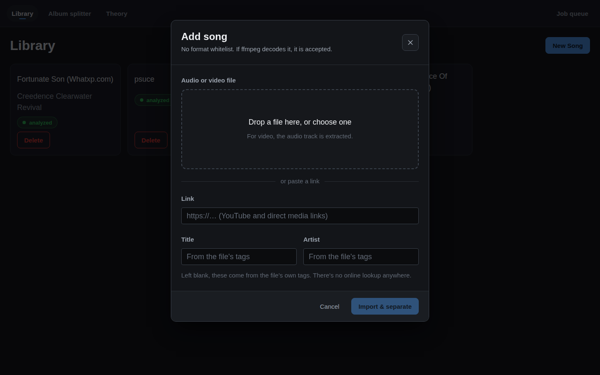
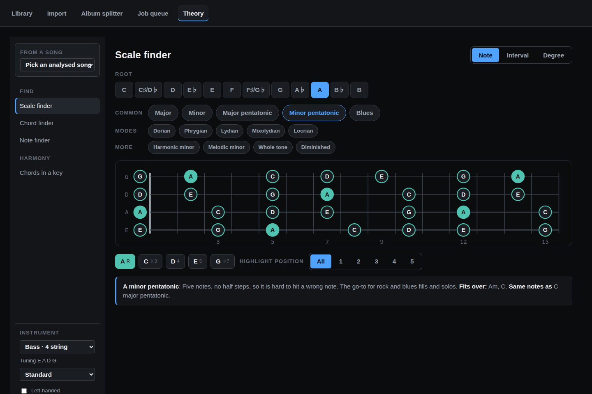
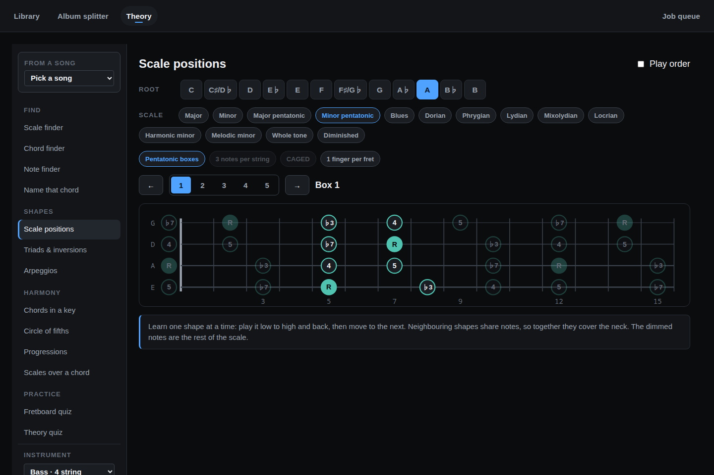
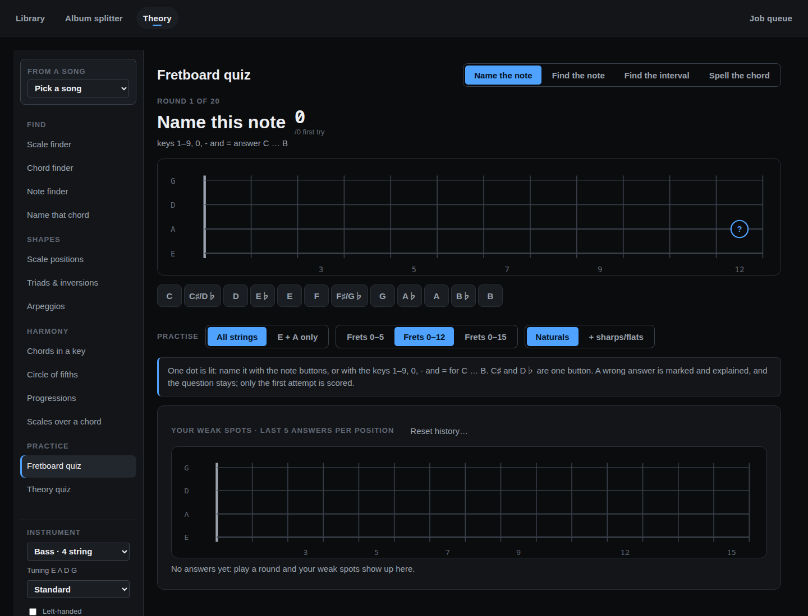
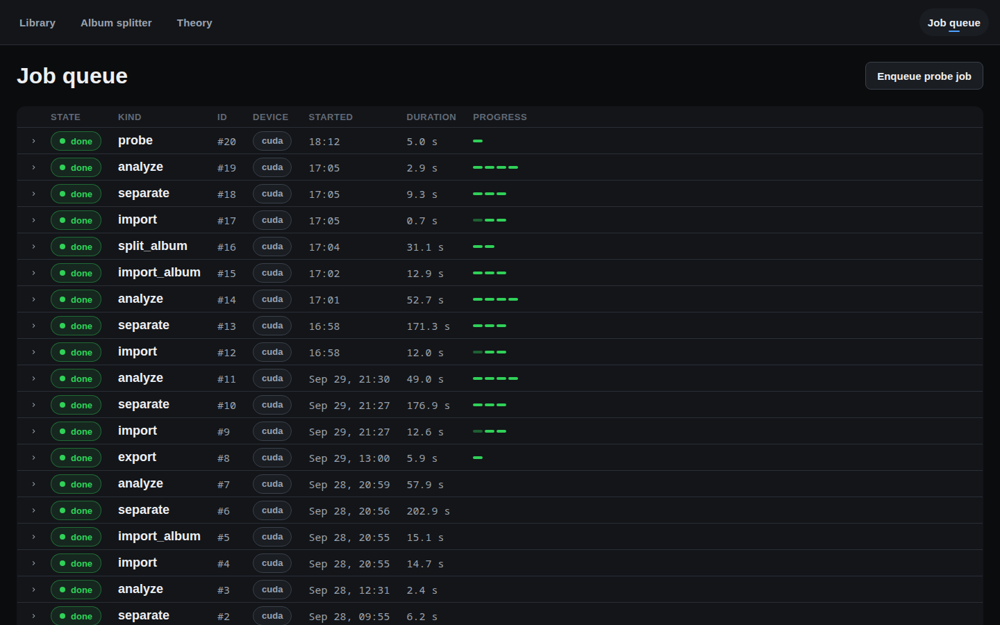

# Stemcraft

Self-hosted, single-user web app that splits songs into stems so you can mute your own
instrument and play along.

- Add a song from a file or a link (YouTube and direct media) in one dialog; any format
  ffmpeg can decode is accepted. The dialog then follows the import, separation and
  analysis live, step by step
- GPU stem separation into vocals, drums, bass and other
- Live mixer: mute, solo and volume per stem
- A thin glow along the navbar pulses with each stem you can hear while a song plays
- Stems view time axis: the wheel zooms at the pointer, dragging across the lanes zooms to
  that range, Shift+wheel or the scrollbar pans, and a click on the ruler seeks
- Tempo (50–150 %, 10 % a press; the arrow keys step 5 %) and pitch (±12 semitones) change without re-separating; stems are never modified
- Sample-accurate seamless loops on the beat grid, set by bar number in the Loop editor (or with the A/B keys at the playhead), saved by name, with optional count-in and metronome under Practice
- Beat, key and chord analysis
- One song screen: a single one-row transport stays put while you switch between Stems (waveforms and the mixer) and Tabs (the play-along neck below); the music never stops. Rename a song's title and artist in place
- Tabs view for bass: a live neck shows what to play in the current and the next
  bar, with a beat lane underneath showing when. The notes are generated from the chord
  chart by a pattern you pick (root, root–5th, root–5th–octave, octave, chord or diatonic triad, 7th; whole
  to eighth notes; optional chromatic, scale or fifth approach into the next bar), in the
  detected key or another candidate, and follow the pitch shift. Click a bar in the chord ribbon
  to jump there; loop by bar numbers or by Ctrl- and Shift-clicking the ribbon
- Theory tab for 4- and 5-string bass and 6-string guitar in any tuning, left-handed too:
  scale, chord and note finders, name a chord from notes you tap, scale positions
  (pentatonic boxes, 3-notes-per-string, CAGED, position boxes), triads and inversions,
  arpeggios, guitar voicings and bass arpeggio shapes, chords in a key, a circle of
  fifths, 15 progressions in any key and scales that fit a chord. Pick an analysed song
  and one of its key candidates to load its key and chords: they show as chips in the
  chord tools, and Progressions charts the song with numerals, borrowed chords labelled.
  Two quizzes ask about your weak spots more often: a fretboard quiz (name the note, find
  the note, find the interval, spell the chord) shows them on a heatmap of the neck, kept
  per tuning, and a theory quiz (keys, chords, intervals) lists your weakest facts; the
  history is kept in `data/theory.json`
- Album splitter: cut a full album rip into tagged MP3s. Silence detection proposes cuts;
  on a full-length waveform you play, zoom with the wheel or by dragging across a range,
  drag, add and delete cuts, or type exact start and end times to the millisecond, then
  download a zip or add the tracks to the library as Songs
- Export the current mix
- Job queue screen: every job shows when it started (or was queued) at a glance, and
  expands to its named steps, live, with a duration each and a failure's real traceback
  under the step that failed
- Failures and CPU fallbacks are shown in the UI with the real error message

## Screens











All nine are captures of the running app, made with
`node scripts/capture-screens.mjs library=/ import=/import song-view=/songs/<id> play-along=/songs/<id>/play "theory=/theory/scale-finder?root=A&scale=minor-pentatonic" "theory-shapes=/theory/scale-positions?root=A&scale=minor-pentatonic" theory-quiz=/theory/fretboard-quiz album-splitter=/splitter/<id> job-queue=/jobs`
(API and dev server running; it loads the pages, and for the Tabs view it presses Space to play a few bars and pause again). The design system these follow —
tokens, components and screen mockups — is in [design/ui](design/ui) (build it with
`python3 design/ui/build.py`), with its rules in [design/ui-spec.md](design/ui-spec.md).

## Run locally

Requirements: Linux, Python 3.12 with [uv](https://docs.astral.sh/uv/), Node.js with npm,
`ffmpeg` and `yt-dlp` on `PATH`, and an NVIDIA GPU with CUDA 12.8 or newer. The RTX 5080
(sm_120) needs the cu128 PyTorch wheels. Both processes refuse to start if a dependency
is missing.

### Quick start: `scripts/dev.sh`

```bash
scripts/dev.sh up
```

This checks that `uv`, `node`, `npm`, `ffmpeg`, `yt-dlp`, `lsof` and `ss` are on `PATH` (it names any
that are missing), runs `uv sync` and `npm --prefix frontend install` when needed, starts the
worker, the API (port 8000) and Vite (port 5173) in the background, and prints
<http://localhost:5173> when they are up. It stops with an error and the log tail if a process
dies on startup. Logs are in `.logs/dev/` (`worker.log`, `api.log`, `frontend.log`):

```bash
tail -f .logs/dev/worker.log
```

Stop everything with:

```bash
scripts/dev.sh down
```

`up` restarts: it first stops any stack it started earlier, including stale processes of this
checkout still holding ports 8000 or 5173. If either port is held by a process that is not
ours (one not running from this checkout), `up` fails immediately with its pid and command and
touches nothing.

### Starting the processes by hand

```bash
uv sync
```

```bash
npm --prefix frontend install
```

Then start the three processes, each in its own terminal.

Worker (all GPU work; it has no port):

```bash
uv run stemcraft-worker
```

API on port 8000:

```bash
uv run uvicorn stemcraft_api.app:create_app --factory --reload --host 0.0.0.0 --port 8000
```

Frontend dev server on port 5173, which proxies `/api` to the API:

```bash
npm --prefix frontend run dev
```

Open <http://localhost:5173>.

`data/theory.json` holds the Theory tab's instrument and quiz history; the API is its only writer.

### Single-origin build

The API serves the built frontend itself, so no Vite process is needed. Run the worker as
above, then:

```bash
npm --prefix frontend run build
```

```bash
STEMCRAFT_DIST_DIR=frontend/dist uv run stemcraft-api
```

Open <http://localhost:8000>.

## Deploy

`ops/install.sh` installs two systemd user units, `stemcraft-api` and `stemcraft-worker`, that
start at boot and restart on failure. `git pull && ops/install.sh` redeploys. Start with
`ops/install.sh --dry-run`, which changes nothing. See [docs/deploy.md](docs/deploy.md) for
requirements, rollback, logs and what has been verified.

## More

- [docs/deploy.md](docs/deploy.md): install, deploy and rollback runbook
- [docs/running.md](docs/running.md): verified transcript of running the whole system
- [design/domain-spec.md](design/domain-spec.md): what the product is
- [design/tech-spec-stemcraft.md](design/tech-spec-stemcraft.md): architecture and decisions
- [CLAUDE.md](CLAUDE.md): invariants for contributors
