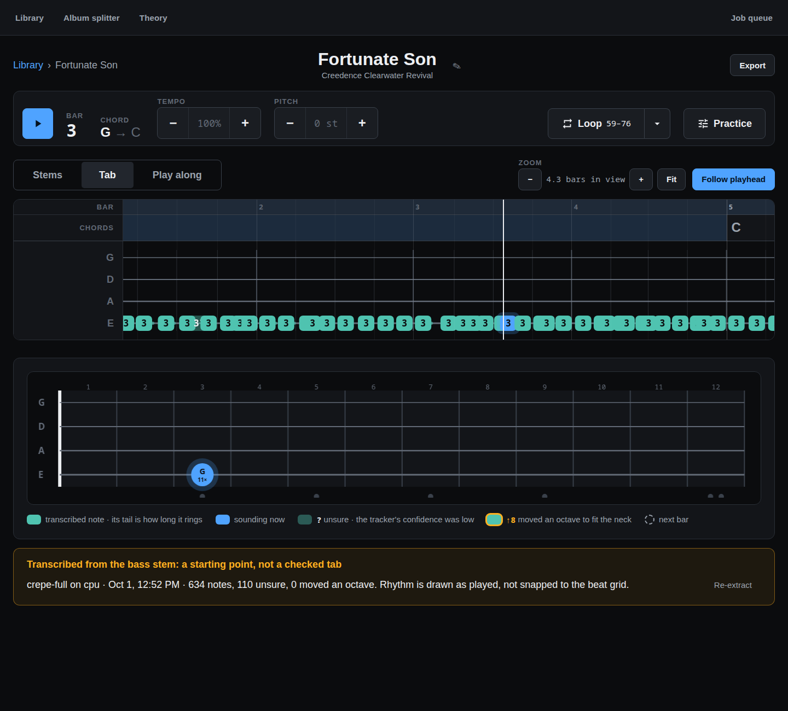
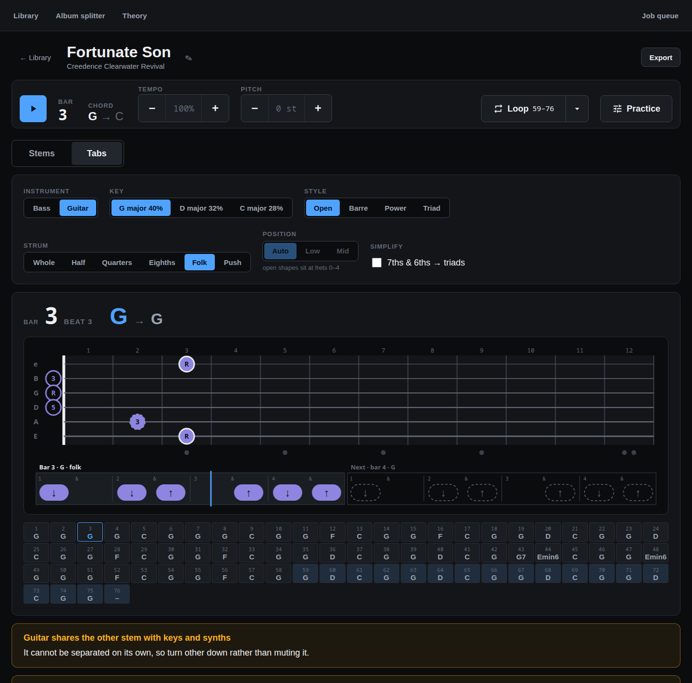

# Stemcraft

Self-hosted, single-user web app that splits songs into stems so you can mute your own
instrument and play along.

- **Import** — add songs from a file or a link (YouTube and direct media)
- **Stem separation** — GPU split into vocals, drums, bass and other
- **Play along** — live mixer (mute, solo, volume), tempo and pitch change, seamless
  loops on the beat grid, count-in and metronome
- **Analysis** — beat, key and chord detection
- **Tablature generator** — transcribe the bass stem into tab
- **Play-along patterns** — generated bass lines and guitar chord shapes from the chord chart
- **Theory tools** — scales, chords, positions and relaxed quizzes for bass and guitar
- **Album splitting** — cut a full album rip into tagged tracks
- **Export** — download the current mix
- **Job queue** — live progress, with real error messages on failure

## Screens







All ten are captures of the running app, made with
`node scripts/capture-screens.mjs library=/ import=/import song-view=/songs/<id> tab=/songs/<id>/tab play-along=/songs/<id>/play play-along-guitar=/songs/<id>/play "theory=/theory/scale-finder?root=A&scale=minor-pentatonic" "theory-shapes=/theory/scale-positions?root=A&scale=minor-pentatonic" theory-quiz=/theory/fretboard-quiz album-splitter=/splitter/<id> job-queue=/jobs`
(API and dev server running; it loads the pages, and for the Tab and Play along views it presses Space to play a few bars and pause again; the Tab capture needs the song's tab extracted first; for the guitar capture, switch that song's Play along to Guitar first, and back to Bass after). The design system these follow —
tokens, components and screen mockups — is in [design/ui](design/ui) (build it with
`python3 design/ui/build.py`), with its rules in [design/ui-spec.md](design/ui-spec.md).

## Run locally

Requirements: Linux, Python 3.12 with [uv](https://docs.astral.sh/uv/), Node.js with npm,
`ffmpeg` and `yt-dlp` on `PATH`, and an NVIDIA GPU with CUDA 12.8 or newer. The RTX 5080
(sm_120) needs the cu128 PyTorch wheels. Both processes refuse to start if a dependency
is missing.

### Quick start: `scripts/dev.sh`

```bash
scripts/dev.sh up
```

This checks that `uv`, `node`, `npm`, `ffmpeg`, `yt-dlp`, `lsof` and `ss` are on `PATH` (it names any
that are missing), runs `uv sync` and `npm --prefix frontend install` when needed, starts the
worker, the API (port 8000) and Vite (port 5173) in the background, and prints
<http://localhost:5173> when they are up. It stops with an error and the log tail if a process
dies on startup. Logs are in `.logs/dev/` (`worker.log`, `api.log`, `frontend.log`):

```bash
tail -f .logs/dev/worker.log
```

Stop everything with:

```bash
scripts/dev.sh down
```

`up` restarts: it first stops any stack it started earlier, including stale processes of this
checkout still holding ports 8000 or 5173. If either port is held by a process that is not
ours (one not running from this checkout), `up` fails immediately with its pid and command and
touches nothing.

### Starting the processes by hand

```bash
uv sync
```

```bash
npm --prefix frontend install
```

Then start the three processes, each in its own terminal.

Worker (all GPU work; it has no port):

```bash
uv run stemcraft-worker
```

API on port 8000:

```bash
uv run uvicorn stemcraft_api.app:create_app --factory --reload --host 0.0.0.0 --port 8000
```

Frontend dev server on port 5173, which proxies `/api` to the API:

```bash
npm --prefix frontend run dev
```

Open <http://localhost:5173>.

`data/theory.json` holds the Theory tab's instrument and quiz history; the API is its only writer.

### Single-origin build

The API serves the built frontend itself, so no Vite process is needed. Run the worker as
above, then:

```bash
npm --prefix frontend run build
```

```bash
STEMCRAFT_DIST_DIR=frontend/dist uv run stemcraft-api
```

Open <http://localhost:8000>.

## Deploy

`ops/install.sh` installs two systemd user units, `stemcraft-api` and `stemcraft-worker`, that
start at boot and restart on failure. `git pull && ops/install.sh` redeploys. Start with
`ops/install.sh --dry-run`, which changes nothing. See [docs/deploy.md](docs/deploy.md) for
requirements, rollback, logs and what has been verified.

## More

- [docs/deploy.md](docs/deploy.md): install, deploy and rollback runbook
- [docs/running.md](docs/running.md): verified transcript of running the whole system
- [design/domain-spec.md](design/domain-spec.md): what the product is
- [design/tech-spec-stemcraft.md](design/tech-spec-stemcraft.md): architecture and decisions
- [CLAUDE.md](CLAUDE.md): invariants for contributors
